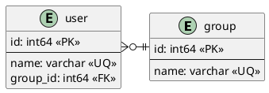

# plantuml

## Generate

```shell
$ oct generate plantuml --help
```

```
OPTIONS:
   --input FILE, -i FILE   read octopus schema from FILE [$OCTOPUS_INPUT]
   --output FILE, -o FILE  geneate plantUML to FILE [$OCTOPUS_OUTPUT]
```

Generate plantUML file:
* `*.wsd`
* `*.pu`
* `*.puml`
* `*.plantuml`
* `*.iuml`

```shell
# example with all CLI options
$ oct generate plantuml \
    --input database.json \
    --output databse.puml
```

### Example

```shell
$ oct generate plantuml \
    --input examples/user.json \
    --output output/user.puml
```

Generated file:




