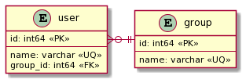

# plantuml

[한국어](kr/plantuml.md)

## Generate

```shell
$ oct generate plantuml --help
```

|      Option      |  Env. Variable   | Description                    |
| :--------------: | :--------------: | :----------------------------- |
| `-i`, `--input`  | `OCTOPUS_INPUT`  | Octopus schema file            |
| `-o`, `--output` | `OCTOPUS_OUTPUT` | Output plantUML file/directory |

The following filename extensions are supported.
Other output filename will be treated as directory name and default filename is `output.plantuml`.

- `*.wsd`
- `*.pu`
- `*.puml`
- `*.plantuml`
- `*.iuml`

### Example

```shell
$ oct generate plantuml \
    --input examples/user.json \
    --output output/user.puml
```

Generated `*.puml` file:

```
@startuml
entity group {
    id: int64 <<PK>>
    --
    name: varchar <<UQ>>
}
entity user {
    id: int64 <<PK>>
    --
    name: varchar <<UQ>>
    group_id: int64 <<FK>>
}
user }o-|| group
@enduml
```


